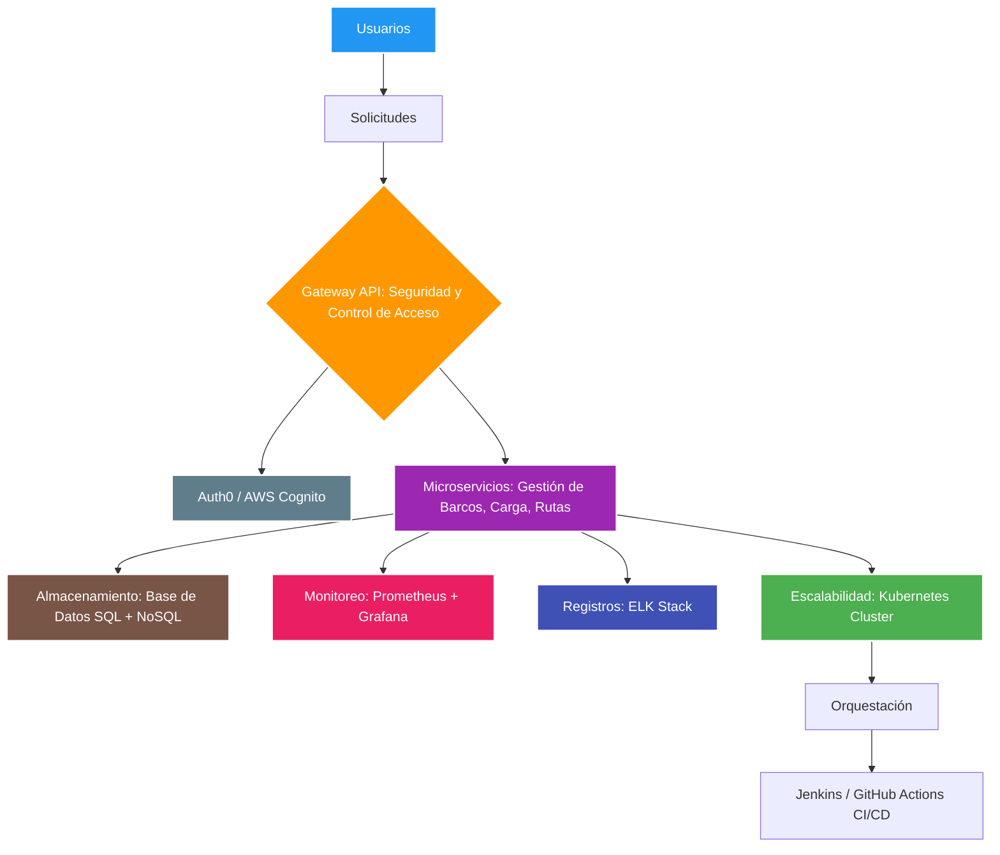
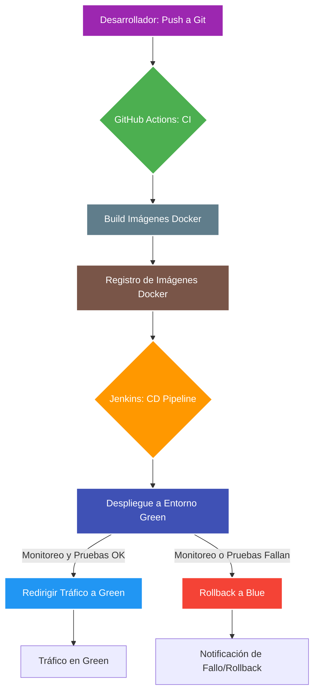
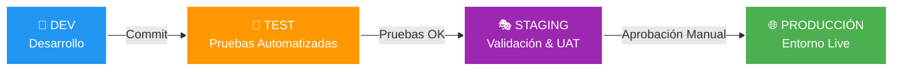
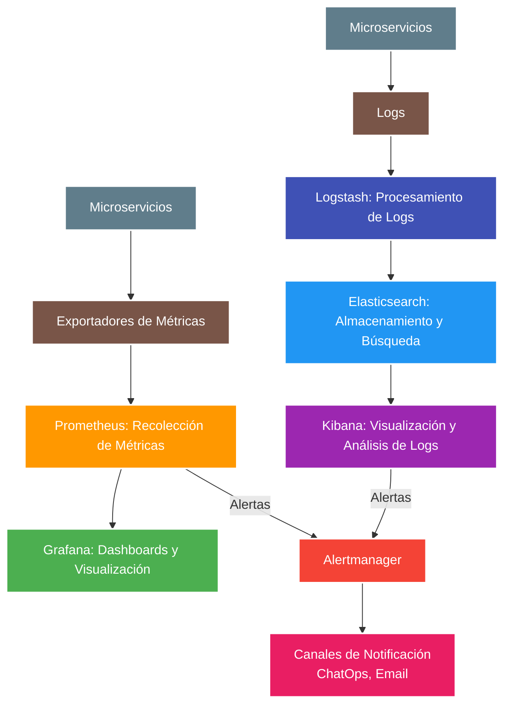
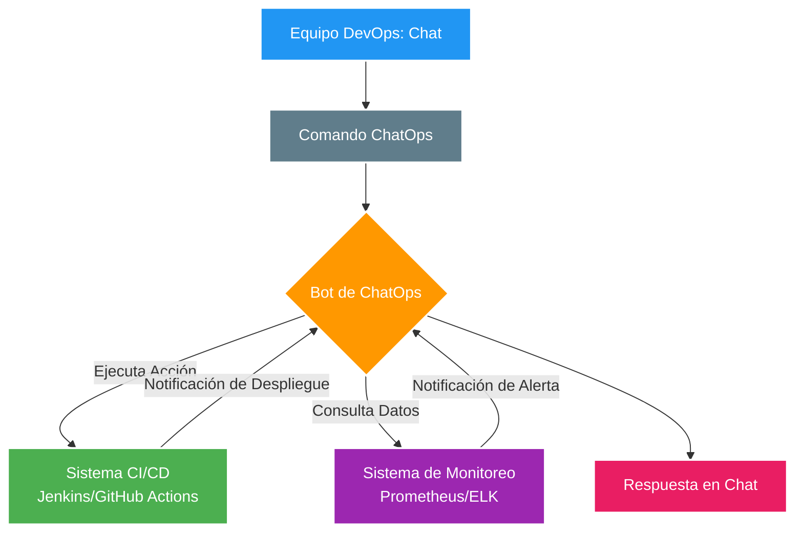

# PortTrack - Estrategia DevOps para Plataforma de Navegación Portuaria

## 🎯 Descripción del Proyecto

PortTrack es una plataforma de navegación portuaria diseñada para monitorear, coordinar y gestionar el flujo de embarcaciones en puertos comerciales. Este documento presenta la estrategia DevOps completa para garantizar una plataforma escalable, resiliente y segura.

### Objetivos Principales

- ✅ **Automatización completa** de procesos de construcción, prueba y despliegue
- 🚀 **Escalabilidad y alta disponibilidad** garantizada 24/7
- 📊 **Monitoreo en tiempo real** y observabilidad completa
- 🔒 **Seguridad integral** en todo el ciclo de vida del desarrollo
- ⚡ **Recuperación rápida** ante fallos con estrategias de rollback

## 🏗️ Arquitectura General

La plataforma PortTrack se construye sobre una arquitectura de microservicios orquestada por Kubernetes, con énfasis en automatización y observabilidad.

### Componentes Clave

| Componente | Tecnología | Propósito |
|------------|------------|-----------|
| **API Gateway** | Nginx Ingress | Punto de entrada unificado, seguridad y enrutamiento |
| **Autenticación** | Auth0/AWS Cognito | Gestión de identidad y autorización |
| **Microservicios** | Docker + Kubernetes | Gestión de Barcos, Carga, Rutas |
| **Base de Datos** | PostgreSQL + MongoDB | Datos relacionales y no estructurados |
| **Monitoreo** | Prometheus + Grafana | Métricas y visualización |
| **Logs** | ELK Stack | Centralización y análisis de logs |
| **CI/CD** | GitHub Actions + Jenkins | Integración y despliegue continuo |

## 🚀 Estrategia de Despliegue Continuo

### Blue-Green Deployment

Implementamos una estrategia de despliegue **Blue-Green** para garantizar cero tiempo de inactividad:

#### Ventajas
- 🟢 **Cero downtime** - Transición instantánea entre versiones
- 🔄 **Rollback rápido** - Reversión inmediata en caso de problemas
- 🧪 **Pruebas en producción** - Validación en entorno real antes del switch
- 🔧 **Compatible con microservicios** - Actualizaciones independientes por servicio

### Pipeline CI/CD

### Herramientas CI/CD

- **GitHub Actions** (CI): Integración continua con ejecución automática de tests
- **Jenkins** (CD): Despliegue continuo con control granular de pipelines
- **Docker Registry**: Versionado y almacenamiento de imágenes de contenedores

## 🏢 Gestión de Entornos

### Estructura de Entornos

| Entorno | Propósito | Despliegue | Datos |
|---------|-----------|------------|--------|
| **DEV** | Desarrollo individual | Automático en cada commit | Datos de prueba |
| **TEST** | Pruebas automatizadas | Tras éxito en DEV | Datos sintéticos |
| **STAGING** | UAT y pruebas de rendimiento | Programado/bajo demanda | Datos anonimizados |
| **PROD** | Entorno de producción | Blue-Green controlado | Datos reales |

### Seguridad y Gestión de Secretos

- 🔐 **Kubernetes Secrets**: Almacenamiento seguro de credenciales
- 🏦 **HashiCorp Vault**: Gestión centralizada con rotación automática
- 🛡️ **RBAC**: Control de acceso basado en roles
- 🔍 **Análisis de seguridad**: SAST y DAST integrados en pipelines

## 📊 Monitoreo y Observabilidad

### Stack de Observabilidad

### Métricas y Alertas

#### Métricas Clave
- 🚀 **Rendimiento**: Latencia de API, throughput, tiempo de respuesta
- 💾 **Recursos**: CPU, memoria, almacenamiento, red
- 🏥 **Salud**: Disponibilidad de servicios, tasa de errores
- 🚢 **Negocio**: Número de embarcaciones, transacciones, operaciones portuarias

#### Configuración de Alertas
- ⚠️ **Críticas**: Latencia > 500ms, CPU > 80%, errores > 5%
- 📢 **Notificaciones**: Slack/Teams, email, PagerDuty
- 🔍 **Logs**: Patrones de error, anomalías de seguridad

## 🤖 ChatOps y Automatización

### Integración con Herramientas de Comunicación

### Comandos Disponibles

| Comando | Función | Ejemplo |
|---------|---------|---------|
| `/porttrack status <servicio>` | Estado del servicio | `/porttrack status barcos` |
| `/porttrack rollback <servicio> <version>` | Rollback manual | `/porttrack rollback api v1.2.3` |
| `/porttrack alert silence <id>` | Silenciar alerta | `/porttrack alert silence alert-001` |
| `/porttrack logs <servicio>` | Obtener logs | `/porttrack logs gateway` |
| `/porttrack alerts active` | Alertas activas | `/porttrack alerts active` |

## 🛠️ Tecnologías Utilizadas

### Infraestructura y Orquestación
-  **Kubernetes**: Orquestación de contenedores
-  **Docker**: Containerización de aplicaciones
-  **Helm**: Gestión de paquetes de Kubernetes

### CI/CD
-  **GitHub Actions**: Integración continua
-  **Jenkins**: Despliegue continuo
-  **Git**: Control de versiones

### Monitoreo y Observabilidad
-  **Prometheus**: Recolección de métricas
-  **Grafana**: Visualización de métricas
-  **ELK Stack**: Gestión de logs

### Bases de Datos
-  **PostgreSQL**: Base de datos relacional
-  **MongoDB**: Base de datos NoSQL

### Seguridad
-  **Auth0**: Autenticación y autorización
-  **HashiCorp Vault**: Gestión de secretos

## 📋 Plan de Implementación

### Fase 1: Planificación y Configuración Inicial
- [ ] Definir estructura del repositorio
- [ ] Configurar clúster de Kubernetes
- [ ] Implementar API Gateway
- [ ] Configurar bases de datos
- [ ] Establecer políticas de backup

### Fase 2: Implementación de CI/CD
- [ ] Configurar GitHub Actions workflows
- [ ] Instalar y configurar Jenkins
- [ ] Crear pipelines Blue-Green
- [ ] Integrar herramientas SAST/DAST
- [ ] Implementar gestión de secretos

### Fase 3: Monitoreo y Observabilidad
- [ ] Desplegar Prometheus y Grafana
- [ ] Configurar ELK Stack
- [ ] Crear dashboards personalizados
- [ ] Configurar sistema de alertas
- [ ] Integrar notificaciones

### Fase 4: ChatOps
- [ ] Seleccionar plataforma de chat
- [ ] Configurar bot de ChatOps
- [ ] Implementar comandos básicos
- [ ] Integrar con sistemas de monitoreo
- [ ] Capacitar al equipo

## 🚦 Estado del Proyecto

| Componente | Estado | Versión |
|------------|--------|---------|
| Arquitectura | ✅ Diseñada | v1.0 |
| CI/CD Pipeline | 🚧 En desarrollo | v0.8 |
| Monitoreo | 📋 Planificado | v0.1 |
| ChatOps | 📋 Planificado | v0.1 |
| Documentación | ✅ Completa | v1.0 |

## 🤝 Contribución

1. Fork el proyecto
2. Crea una rama para tu feature (`git checkout -b feature/AmazingFeature`)
3. Commit tus cambios (`git commit -m 'Add some AmazingFeature'`)
4. Push a la rama (`git push origin feature/AmazingFeature`)
5. Abre un Pull Request

## 📞 Contacto

Para preguntas sobre la implementación de esta estrategia DevOps, contacta al equipo:

- 📧 Email: devops@porttrack.com
- 💬 Slack: #porttrack-devops
- 📱 Teams: PortTrack DevOps Channel

## 📄 Licencia

Este proyecto está licenciado bajo la Licencia MIT - ver el archivo [LICENSE](LICENSE) para más detalles.

---

**PortTrack DevOps Strategy** - Transformando la gestión portuaria con DevOps de clase mundial

